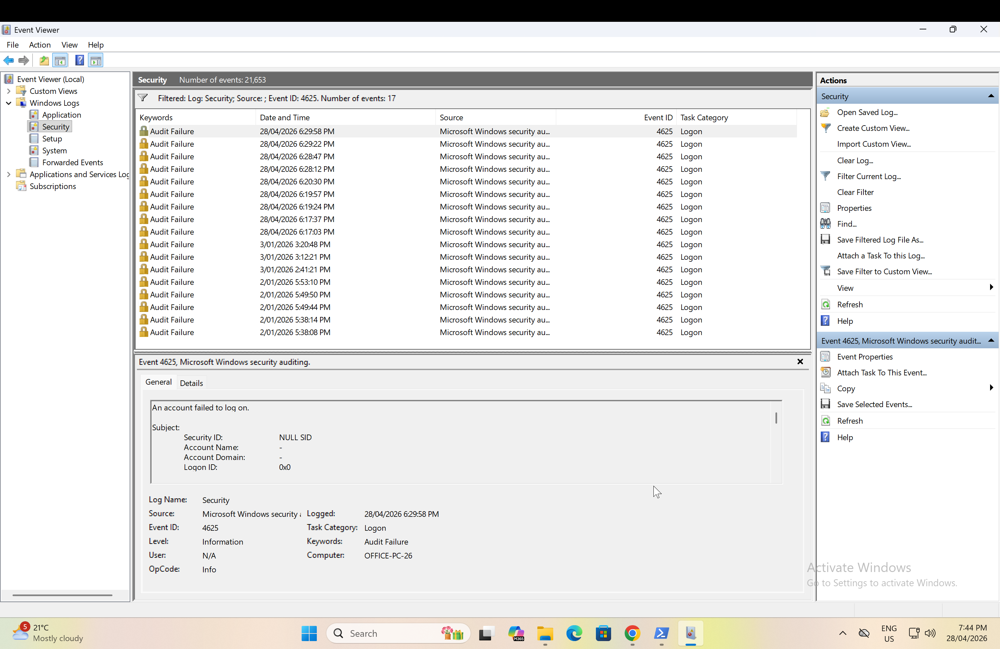
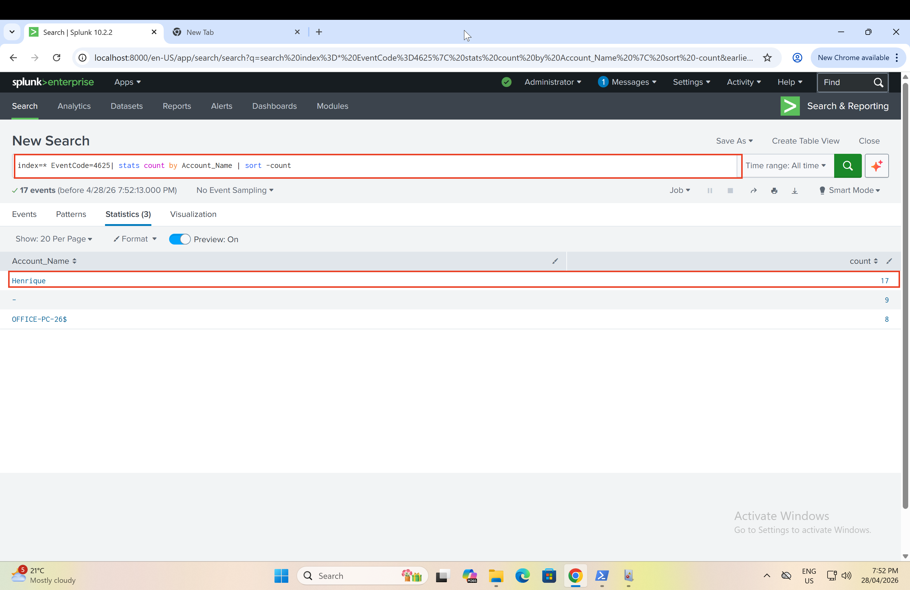
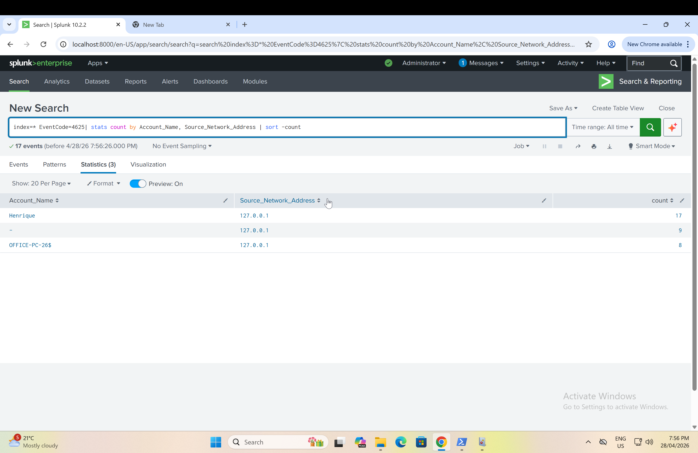
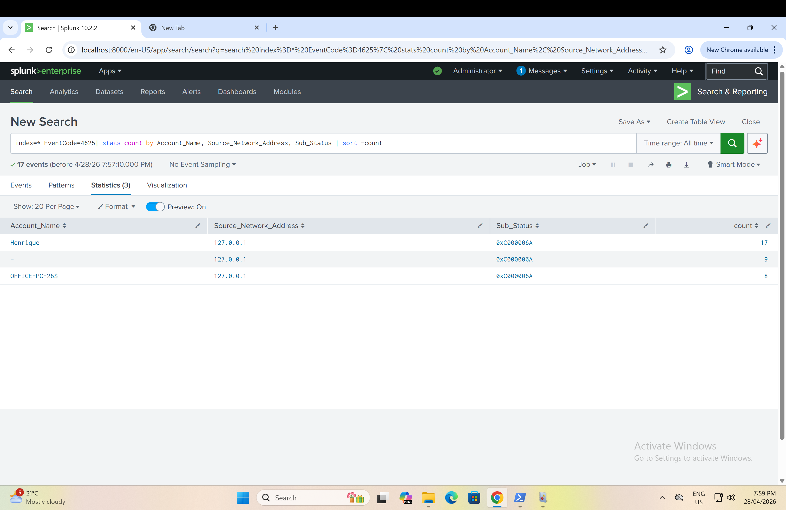

# Splunk Failed Logon Investigation — Windows EventCode 4625

A hands-on investigation of failed Windows logon events using Splunk and real Windows Security Event Logs. This project demonstrates how to identify brute force attacks and account enumeration by analyzing EventCode 4625 with progressive SPL queries.

---

## Environment

| Item | Detail |
|------|--------|
| SIEM | Splunk (Search & Reporting) |
| Data source | Windows Security Event Log (`sourcetype="WinEventLog:Security"`) |
| Key event | EventCode 4625 — Failed Logon |
| Platform | Windows VM (VMware) |

---

## Investigation Workflow

1. Confirm events exist in Splunk: `index=* EventCode=4625 | head 5`
2. Open Windows Event Viewer — Security log — confirm EventCode 4625 is generated natively
3. Expand a raw event in Splunk — identify available fields: `TargetUserName`, `IpAddress`, `SubStatus`, `LogonType`
4. **Query 1:** Count failed logons by target account — find who is being attacked
5. **Query 2:** Add source IP — find where the attack is coming from
6. **Query 3:** Add SubStatus — determine what type of failure and what it means

---

## Key Findings

- **25 failed logon attempts** recorded against a single account within a 1-minute window
- All attempts originated from the **same source IP**
- SubStatus on every event: `0xC000006A` — correct username, wrong password
- **Pattern: Consistent with Targeted Brute Force**

The SubStatus code is the critical differentiator:

| SubStatus | Meaning | Attack Pattern |
|-----------|---------|----------------|
| `0xC000006A` | Correct username, wrong password | Brute force |
| `0xC0000064` | Username does not exist | Account enumeration |
| `0xC0000234` | Account is locked out | Lockout threshold triggered |
| `0xC0000072` | Account is disabled | Misconfigured service or old credentials |

---

## Screenshots

### Source Event — Windows Event Viewer

### Expanded Raw Event in Splunk

### Query 1 — Who is targeted?

### Query 2 — Where is it coming from?

### Query 3 — What type of failure?

### Attack Pattern

---

## Skills Demonstrated

- Splunk Search & Reporting: SPL queries with `stats`, `sort`, `eval`
- Windows Security Event Log analysis: source confirmation in Event Viewer, EventCode 4625 field structure
- SubStatus code interpretation: brute force vs. enumeration classification
- Progressive investigation: building from "who" to "where" to "why"
- SOC ticket writing: structured finding documentation

---

## Queries

See [queries/splunk-queries.md](queries/splunk-queries.md) for all queries with field-level comments.

## Findings

See [findings/findings.md](findings/findings.md) for the full investigation finding in SOC ticket format.

## Interview Prep

See [interview-prep/summary.md](interview-prep/summary.md) for a verbal walkthrough of this project and expected interview questions.

---

## Next Step

This investigation confirms failed logon attempts from a single IP. The next question: **did this IP ever successfully log in?**

That requires correlating EventCode 4625 (failed) with EventCode 4624 (successful logon) — covered in the next video.
